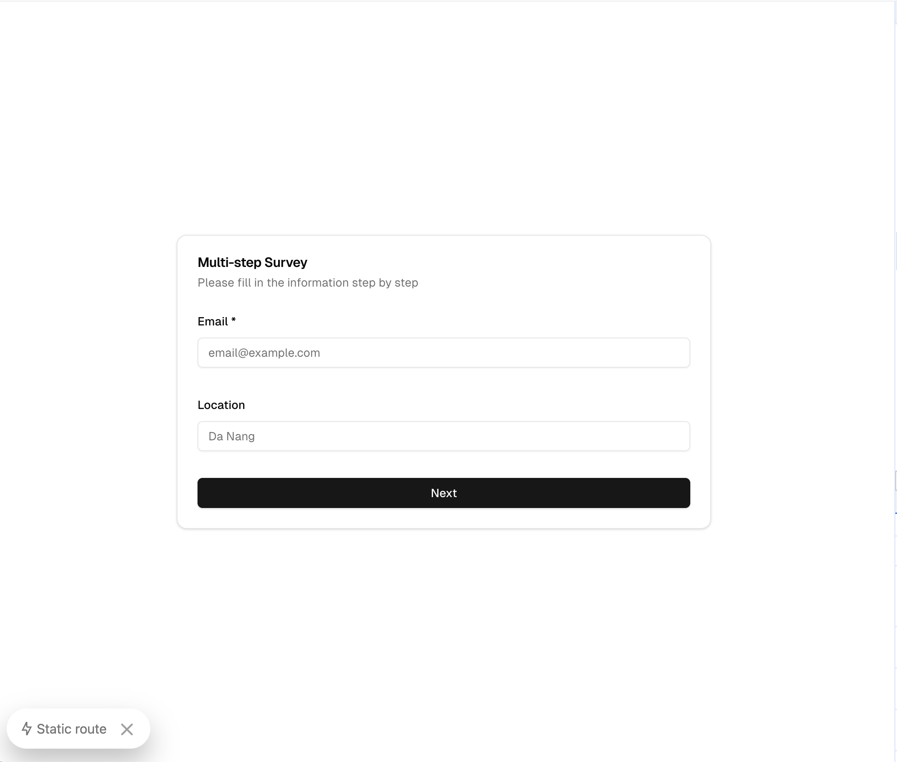
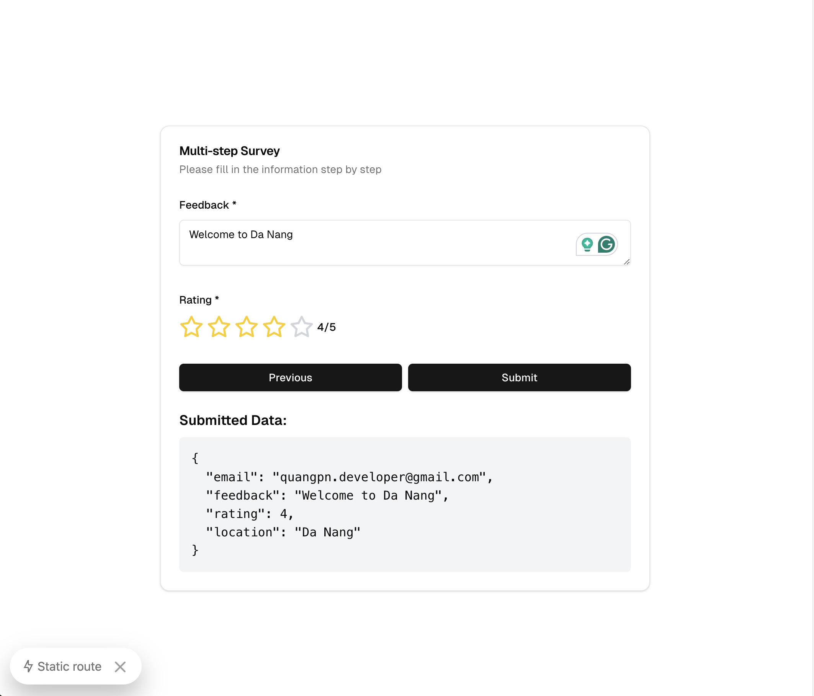

# Multi-step Survey Form - Next.js Project

## TECH STACKS:

### Libraries:

- [Next.js - v15.0.0-canary.179](https://nextjs.org/): A React framework for building full-stack web applications with server-side rendering and static site generation.
- [React - v19.0.0-beta-26f2496093-20240514](https://react.dev/learn): A JavaScript library for building user interfaces.
- [React DOM - v19.0.0-beta-26f2496093-20240514](https://reactjs.org/docs/react-dom.html): Provides DOM-specific methods for React.
- [Zod - v^3.23.8](https://github.com/colinhacks/zod): TypeScript-first schema validation with static type inference.
- [Shadcn/ui - v^0.0.4](https://ui.shadcn.com/): A collection of re-usable components built using Radix UI and Tailwind CSS.
- [React Hook Form - v^7.53.0](https://react-hook-form.com/): A library for managing form state in React applications.
- [Tailwind CSS - v^2.5.2](https://tailwindcss.com/): A utility-first CSS framework for rapidly building custom user interfaces.
- [Lucide React - v^0.446.0](https://lucide.dev/): A set of beautifully crafted open-source icons for React applications.

### Development Tools:

- [TypeScript - v^5](https://www.typescriptlang.org/): A typed superset of JavaScript that compiles to plain JavaScript.
- [ESLint - v^8](https://eslint.org/): A tool for identifying and reporting on patterns found in ECMAScript/JavaScript code.
- [Prettier - v^3.1.1](https://prettier.io/): An opinionated code formatter.

## Project Overview:

This project demonstrates a multi-step survey form implementation using React 18's new features and Next.js 14's app router and server actions. The form is built with React Hook Form for state management and Zod for schema validation. It showcases:

1. Multi-step form navigation
2. Form validation using Zod schemas
3. Server-side form submission using Next.js server actions
4. Responsive design with Tailwind CSS
5. Reusable UI components from shadcn/ui

## Getting Started

### Prerequisites:

Ensure you have Node.js and pnpm installed on your system. It's recommended to use the versions specified in the `package.json` file.

### Running the Project

To run the project locally, follow these steps:

1. Install dependencies:

   ```
   pnpm install
   ```

2. Start the development server:

   ```
   pnpm dev
   ```

3. Open your browser and navigate to `http://localhost:3000` to view the application.

For production builds:

1. Build the project:

   ```
   pnpm build
   ```

2. Start the production server:
   ```
   pnpm start
   ```

## Key Features

1. Multi-step form with validation at each step
2. Server-side form submission using Next.js server actions
3. Client-side form state management with React Hook Form
4. Schema validation with Zod
5. Responsive design using Tailwind CSS
6. Reusable UI components from shadcn/ui
7. Use of useFormStatus hook for handling form submission states

This project serves as a practical example of building modern, interactive forms with the latest React and Next.js features, demonstrating best practices in form handling, validation, and submission in a server-side rendering environment.

### Screenshots

